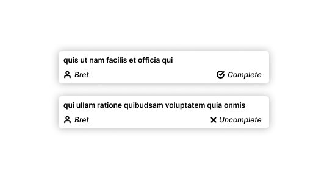

# React Native Take Home Exam

You can edit the whole project in any way you like and add dependencies where you think they make sense, except where explicitly forbidden.

# Tasks

## 1. Run the app

In this task, you are required to clone this Git repository containing a React Native app and then build and run the app on a physical device or simulator. This task is designed to ensure you can set up the development environment correctly and execute a React Native project.

## 2. Load users from the backend

Additionally, the backend team has supplied an API endpoint (https://jsonplaceholder.typicode.com/users) that returns a list of users in JSON format. Your task involves fetching the list of users from the backend, mapping user IDs to their respective usernames, and presenting the usernames on the user interface. Proper error handling for the API request is expected, along with documentation detailing your implementation approach and any challenges faced.

## 3. Redesign the ToDo Card

In this task, you will be provided with a design for the `ToDoCard` component in the form of an image and a Figma file. Your objective is to refactor the existing React Native component's design to match the provided design. The focus will be on implementing the visual changes, ensuring responsiveness, and maintaining component reusability while adhering to the design specifications.

[Figma Design Board](https://www.figma.com/file/NdECMSVwhlKleFXgqHMFaS/React-Native-Take-Home?type=design&node-id=0%3A1&mode=design&t=8erirfEoUlKh9UAU-1)

## 4. Filters

Your objective is to implement a "Completed" filter that allows users to view either completed or incomplete tasks based on their selection. Your task involves designing the filter UI, implementing the filter functionality, updating the user interface based on the filter selection.

## 5. Refactor, improve, enhance

Feel free to unleash your creativity and enhance the codebase as much as you like. This could include breaking up code into smaller units, extracting code into different files, and utilizing a code formatter to maintain consistency. If your existing code is already exceptional; however, there's a bonus task awaiting you below.

## BONUS: Local Notifications

Now, we want you to add a crucial feature - the ability to schedule notifications when a Todo's due date is reached. You can randomly set a due date (between 10 and 120 seconds in the future) for each todo when the todos load. You should implement this feature using native APIs in the simplest way possible. Avoid using external libraries; we want to see your proficiency in working directly with native functionalities (Java/Kotlin/Swift/Objective-C).

# Rules
 * **Honesty and Integrity**: We expect all applicants to demonstrate honesty and integrity. Of course you can use Google etc. but copying code verbatim from StackOverflow is not cool.
 * **Individual Effort**: This exam is meant to assess your individual skills and capabilities. Therefore, it is essential that you complete the tasks on your own.
 * **Language and Tools**: The exam is centered around React Native development. You are free to use any supporting tools or libraries commonly used in the React Native ecosystem, except where forbidden.
 * **Code Quality**: Write clean, organized, and well-documented code. Use common sense while commenting your code.
 * **User Interface**: While not always explicitly stated, consider UI/UX best practices when implementing the tasks. Some styling will be appreciated.
 * **Version Control**: Use Git to track your code changes. We encourage you to make frequent commits (at least in between tasks) to showcase your development process.
 * **Documentation**: Provide a brief overview of your approach and thought process for each task. Explain any trade-offs you made and challenges you encountered.
 * **Communication**: In case of any clarifications or questions regarding the tasks, feel free to reach out to us through the provided communication channels.